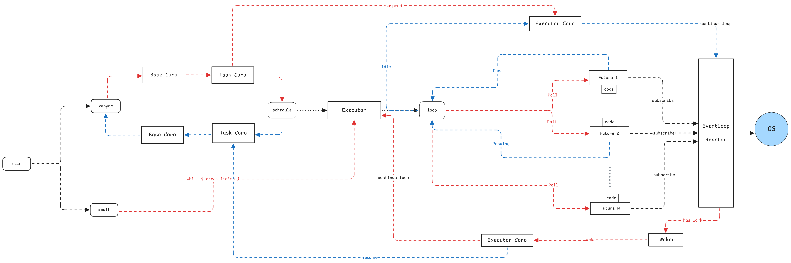

# 低侵入式的异步协程框架

非常高兴能参加操作系统训练营第三阶段异步课程

向勇老师给与了很大的鼓励
周积萍同学给与了给很多帮助和支持

从其他同学那学到了很多重要的相关资料和代码

**目标**

- 长期目标：低侵入式的异步协程运行时，服务于操作系统内核
- 本期目标：用 zig 实现简单的异步协程机制

我的整个过程主要包含学习和实验两部分：

**学习内容**

- 迷你 coroutine
- rust future 
  - rust
  - 100 loc future
- 200 行代码绿色线程

**实验部分**

- zig-call-rs-fn
- xasync 异步协程运行时

## 从使用者角度出发

从使用者的角度出发，什么样的协程用起来才是最舒服的

我认为尽量降低，代码编写人员在上层业务场景下感知到异步的
目前 rust 函数着色问题，肯定不是最优解

```rs
fn long_time_action() {

}

fn other_action() {
    
}

fn main() {
    let frame = xasync(long_time_action)
    xawait(frame) // 需要等待才等待
    
    other_action()
}
```

基于以上的探索，分别做了如下尝试

## Future 机制

```zig

const Counter = struct {
    const Self = @This();
    num: u32,
    max: u32,

    fn init(num: u32, max: u32) Self {
        return .{
            .num = num,
            .max = max,
        };
    }

    fn doCount(ctx: *Context) Result {
        const counter = @as(*Counter, @ptrCast(@alignCast(ctx.payload)));
        if (counter.num < counter.max) {
            std.debug.print("counter num = {}\n", .{counter.num});
            counter.num += 1;
            return .wait;
        } else {
            return .{ .done = &counter.num };
        }
    }
};

test "counter-chain-done" {
    const allocator = std.testing.allocator;

    var executor = Executor.init(allocator);
    defer executor.deinit();

    var counter = Counter.init(0, 5);
    const fut = runWithAllocator(allocator, Counter.doCount, &counter).chain(Counter.printNum);

    executor.schedule(fut);

    executor.run();
}
```

- 尽量做到零成本抽象
- 非常容易的支持支持 Join 和 Then

## 绿色线程 (协程)

- 支持协程(绿色线程)间的任意切换

```zig
var base_coro: Coroutine = undefined;
var count_coro: Coroutine = undefined;
var count: i32 = 1;

fn addCount() void {
    count += 1;
    base_coro.resumeFrom(&count_coro);
    count += 1;
    base_coro.resumeFrom(&count_coro);
    count += 1;
    base_coro.resumeFrom(&count_coro);
}

test "simple counter suspend and resume coroutine" {
    const allocator = std.testing.allocator;

    base_coro = try Coroutine.init(allocator, null);
    defer base_coro.deinit();
    count_coro = try Coroutine.init(allocator, addCount);
    defer count_coro.deinit();

    try std.testing.expect(1 == count);

    count_coro.resumeFrom(&base_coro);
    try std.testing.expect(2 == count);

    count_coro.resumeFrom(&base_coro);
    try std.testing.expect(3 == count);

    count_coro.resumeFrom(&base_coro);
    try std.testing.expect(4 == count);

    std.debug.print("all finished\n", .{});
}
```

## 事件响应机制

- 基于事件回调机制

```zig
pub fn poll(self: *Self, timeout_ms: i32) !usize {
    try self.events.resize(16); // 预分配事件数组

    const n = std.posix.epoll_wait(self.epfd, self.events.items, timeout_ms);

    for (self.events.items[0..n]) |event| {
        const fd = event.data.fd;

        if (self.callbacks.get(fd)) |callback| {
            if (event.events & std.posix.system.EPOLL.IN != 0) {
                var buf: [8]u8 = undefined;
                _ = std.posix.read(fd, &buf) catch {}; // 这里目前只处理了 timer 的情况

                if (callback.callback_fn) |func| {
                    func(callback.user_data);
                }
            }
        }
    }

    return n;
}
```

## 有栈、无栈整合

整合完毕后的结果如下：

```zig
xasync(delay);
xawait(); // 需要等待的时候开启
std.debug.print("hello xasync\n", .{});
```

## 总体设计思路



## 参考文献资料

- [200 行 Rust 代码实现绿色线程 / 有栈协程](https://www.bilibili.com/video/BV14EUCY8Efo/?vd_source=1f499e0d3ee2ccc59156087c1ac8221c)

## 后续规划

- 参数和返回值的类型推导机制
- 支持线程池
- eventloop 完善
- 支持 rust 调用
- 封装 asyncio
- 集成到 arceos/rcore 中
