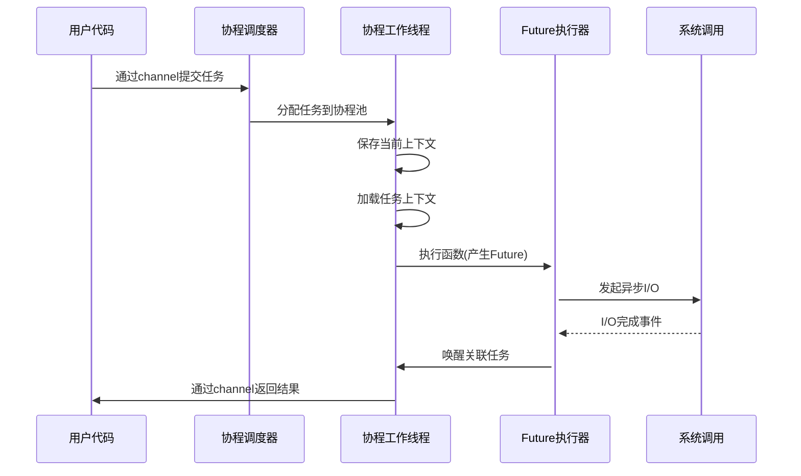

- async-os - 用自己的思路来重写 epoll 的实现 - 对比性能
- ariel-os async 实现机制分析 - 参考liuyifan的分享
- 支持 tun 模式 - 这样能方便交给上次支持
- 网卡驱动到底是什么 - 如何实现的？
- io 多路复用自己实现
- 写一个聊天服务器，在 arceos 上跑起来
- 操作系统添加 trace 机制来统计调用时间消耗长的地方
- 向勇老师分享的资料 - 吴一凡 rcore 的编写者 - 仔细研究

- 思路
  - 保存函数执行的上下文
  - 建立有栈协程池，类似 goroutine
  - 向协程池提交任务，可能用到 channel 机制，任务中包含了要执行函数的上下文信息 - 相当于一个复用的栈切换机制
  - 利用任务中保存好的函数上下文，调用函数 - 这里不是栈切换而是直接利用汇编调用 - 在调用底层 API 时会产生 future 进行统一调度
  - 建立任务 - 函数上下文 - future 之间的关联关系
  - 在调度的时候，while future poll 如果有返回结果，就关联返回结果，最终能通过 channel 通知要返回的结果
  - future 的返回结果，返回到任务，通过 channel 再发回去
  

- 长期要学习的目标
  - 网络编程 - 操作系统级别实现 posix api 系统调用
  - 网络协议 - 操作系统级别支持网络协议栈
  - IO 多路复用
  - 高并发异步编程
  - 网络驱动 - tun 驱动支持 dpdk 支持